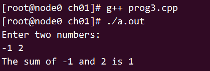
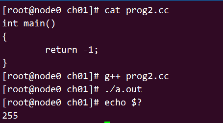

开始

# 笔记

## 编译运行一个C++程序

prog1.cc

```c++
int main()
{
	return 0;
}
```

从命令行运行编译器

```shell
# CC prog1.cc
# 编译
g++ -o prog1 prog1.cc
# 说明
# -o prog1：指定编译器参数，输出为prog1，默认输出为a.out
# -std=c++0x：支持c++11

# 运行
./prog1
```

关于返回值

用来指示状态，0表示成功，非0由系统定义，通常用来指出错误类型

## 一个使用IO库的程序

prog3.cpp

```c++
#include <iostream>
int main()
{
	std::cout << "Enter two numbers:" << std::endl;
	int v1 = 0, v2 = 0;
	std::cin >> v1 >> v2;
	std::cout << "The sum of " << v1 << " and " << v2 << " is " << v1 + v2 << std::endl;
	return 0;
}
```

运行

 

标准输入输出对象

1. cin 标准输入
2. cout 标准输出
3. cerr 标准错误
4. clog 输出一般性信息

# 1.1 节练习

## 练习1.1  

> 编译器

[为Visual C++项目创建的文件类型](https://msdn.microsoft.com/zh-cn/library/3awe4781(v=vs.120).aspx)

常用编译器有GNU编译器和Visual Studio编译器

1. GNU编译器的命令是g++
2. Visual Studio编译器的命令是c1

## 练习1.2 

> 返回-1

 