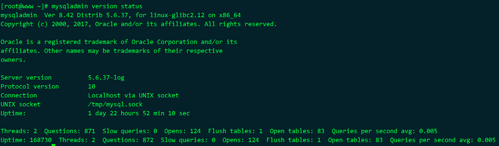

# 2 安装MySQL和MariaDB

## 2.1 安装包

MySQL和MariaDB的安装包带有的几个程序：

1. mysqld守护进程，服务器程序，监听一个特定端口(默认3306)
2. mysql，客户端
3. mysqld_safe脚本，
4. mysqlaccess，用于创建用户账号和设置权限
5. mysqladmin，命令行的数据库服务器管理工具
6. mysqlshow，显示数据库和各表信息，查看服务器状态
7. mysqldump，导出dump文件(包含表结构和数据的纯文本文件)的工具

## 2.2  许可

双重许可方式

1. 一种是遵循GPL免费使用
2. 另一种是收费的商业许可证

## 2.3 获取软件

MySQL网站：https://dev.mysql.com/downloads/mysql/

镜像站：https://dev.mysql.com/downloads/mirrors/

MariaDB网站：https://downloads.mariadb.org/mariadb/

检查是否有运行的MySQL，它只是告诉你 MySQL 的守护进程有没有在运行 

```shell
# Linux或Mac
ps aux | grep mysql

# Windows
tasklist /fi "IMAGENAME -eq mysqld.exe"
```

还可以使用mysqladmin命令

```shell
mysqladmin -S /tmp/mysql3376.sock -uroot -p123456 version status
# 说明
# -S /tmp/mysql2276.sock 指定socket文件，默认在/tmp/mysql.sock
# -uroot -p 指定用户名密码，如果有localhost域无密的匿名用户，这个参数也可以省了
```

 

## 2.4 挑选发行版

下载最新的稳定版，即正式版(GA)

## 2.5 各种_AMP

AMP这个缩写代表Apache、MySQL/MariaDB和PHP/Perl/Python

AMP包基于操作系统

1. LAMP----Linux----http://www.apachefriends.org/en/xampp-linux.htm 
2. MAMP----MAC----http://sourceforge.net/projects/mamp/ 
3. WAMP----Windows----http://www.easyphp.org/download.php 

### 2.5.1 Linux二进制发行版

MySQL提供的二进制安装包包括

1. **MySQL服务器** 重要
2. **共享组件** 重要
3. 兼容库
4. **客户端工具** 重要
5. 嵌入式
6. 测试套件

命令规则一般是(Debian安装包名以.deb结尾)

1. MySQL-server-version.rpm
2. MySQL-client-version.rpm
3. MySQL-shared-version.rpm

MySQL提供的库

1. yum 库  http://dev.mysql.com/downloads/repo/yum/ 
2. apt 库  http://dev.mysql.com/downloads/repo/apt/ 
3. MariaDB  https://downloads.mariadb.org/mariadb/repositories/

yum安装

```shell
# 安装MySQL
yum install MySQL-server-version.rpm \
MySQL-client-version.rpm MySQL-shared-version.rpm

# 安装MariaDB
yum install MyriaDB-server MariaDB-client
```

rpm安装

```shell
# 安装MySQL
rpm -ivh MySQL-server-version.rpm \
MySQL-client-version.rpm MySQL-shared-version.rpm

# 升级MySQL
rpm -Uvh MySQL-server-version.rpm \
MySQL-client-version.rpm MySQL-shared-version.rpm

# 说明
# -U参数代表升级
```

### 2.5.2 Mac OS X发行版

略...

### 2.5.3 Windows发行版

略...

### 2.5.4 FreeBSD和Sun Solaris发行版

略...

### 2.5.5 源码包

在安装源码包之前， 你得先准备好 GNU 的 gunzip、 tar、 gcc（ v2.95.2 或以上）和 make 

下载并解压源码包，以root执行以下命令

```shell
groupadd mysql
useradd -g mysql mysql
tar xzvf /tmp/mysql-version.tar.gz
cd mysql-version
```

设置源码文件，以便构建二进制文件

```shell
./configure --prefix=/usr/local/mysql \
--with-unix-socket-path=/tmp \
--with-charset=latin2

# --prefix 改变默认安装路径
# --with-unix-socket-path 改变Unix套接字文件的路径
# --with-charset 改变默认latin1字符集
```

查看其他配置选项

1. 执行如下命令

   ```shell
   # 查看其他配置选项，执行如下命令
   ./configure --help
   ```

2. 参考“编译 MySQL”的网上文档（ http://dev.mysql.com/doc/refman/5.6/en/compilationproblems.html）。 

构建二进制文件

```shell
make
make install
cd /usr/local/mysql
./scripts/mysql_install_db
```

更改程序和目录的权限

```shell
chown -R mysql /usr/local/mysql
chgrp -R mysql /usr/local/mysql
```

启动守护进程

```shell
/usr/local/mysql/bin/mysqld_safe &
```

设置开机启动

```shell
cp support-files/mysql.server /etc/init.d/mysql
chmod +x /etc/init.d/mysql
chkconfig --add mysql

# 第一行是惯例做法，将启动文件放到服务器的守护进程初始化目录，并改名为 mysql。
# 第二行使该文件可执行。
# 第三行将其启动级别定为开机和关机。
```

## 2.6 安装后

### 2.6.1 特殊配置

MySQL主配置文件：

1. 类Unix系统中：/etc/my.cnf
2. Windows中：c:\windows\my.ini或者c:\my.cnf

### 2.6.2 给root设置初始密码

使用mysqladmin

```shell
mysqladmin -u root -p flush-privileges password "new_pwd"
mysqladmin -u root -p flush-privileges password

# 说明
# 推荐第二种，因为第一种将密码明文显示在命令行上了
```

### 2.6.3  关于密码的更多问题，以及删除匿名用户

MySQL中的权限是根据用户名和主机来决定的。

1. %是指任何主机
2. 空用户名加localhost组合，这就是匿名用户

```shell
mysql -u root -p -e "select user, host, from mysql.user;"
```

修改密码和删除权限组合

```shell
mysql -u root -p -e "set password for 'root'@'127.0.0.1' password('new_pwd');"
mysql -u root -p -e "set password for 'root'@'localhost' password('new_pwd');"
mysql -u root -p -e "drop user 'root'@'%';"
mysql -u root -p -e "drop user ''@'localhost';"
```

刷新权限，使密码生效

```shell
mysqladmin -u root -p flush-privileges
```

### 2.6.4 创建用户

创建一个用户

```shell
grant usage on *.* to 'russell'@'localhost' identified by 'Rover#My_1st_Dog&Not_Yours!';

# 说明
# *.*表示所有数据库和所有表
```

授权

```shell
grant select on *.* to 'russell'@'localhost';
show grants for 'russel'@'localhost' \G
grant all on *.* to 'russell'@'localhost';
```

创建一个本地匿名用户？？？

```shell
grant usage on *.* to ''@'localhost' identified by '';
grant all on *.* to ''@'localhost';
```

