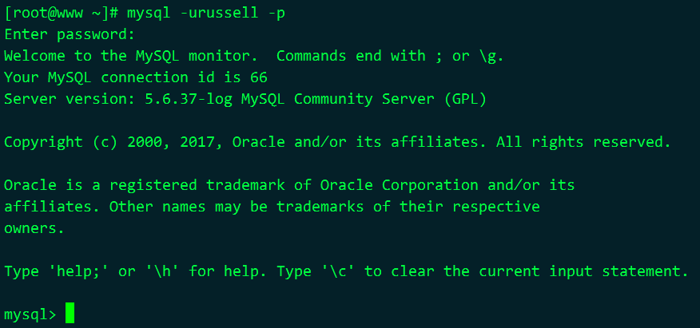

# 基础知识与mysql客户端

## 3.1 mysql客户端

## 3.2 连接到服务器

连接到服务器后的样子

```shell
mysql -urussell -p
```

 

修改提示符

```shell
prompt SQL Command \d>\

# 说明
# \d表示默认数据库
```

## 3.3 开始探索数据库

查看数据库

```shell
SHOW DATABASES;

# 说明
# MySQL不区分关键字的大小写，数据库、表和列的名字区分大小写
# 大多数书籍和文档将关键字大写，其他小写

# result
mysql> show databases;
+--------------------+
| Database           |
+--------------------+
| information_schema |
| mysql              |
| performance_schema |
| test               |
+--------------------+

# 说明
# information_schema 数据库包含服务器的相关信息
# mysql 存储着用户名、密码和权限
# test 用于测试和练习
```

### 3.3.1 第一条SQL语句

在test数据库创建books表

```shell
CREATE TABLE test.books(book_id INT, title TEXT, status INT);
```

查看数据库中有哪些表

```shell
SHOW TABLES FROM test;

# USE test之后可省略
SHOW TABLES;
```

使用数据库

```shell
USE test;
```

创建数据库，如果没有test

```shell
CREATE DATABASE test;
```

查看表字段

```shell
DESCRIBE books;

# 可以简写成
DESC books;
```

### 3.3.2 插入和操作数据

插入

```shell
INSERT INTO books VALUES(100, 'Heart of Darkness', 0), (101, 'The Catcher of the Rye', 1), (102, 'My Antonia', 0);
```

查询

```shell
SELECT * FROM books;
# result
+---------+------------------------+--------+
| book_id | title                  | status |
+---------+------------------------+--------+
|     100 | Heart of Darkness      |      0 |
|     101 | The Catcher of the Rye |      1 |
|     102 | My Antonia             |      0 |
+---------+------------------------+--------+
3 rows in set (0.00 sec)
```

使用WHERE

```shell
SELECT * FROM books WHERE status = 1;
# result
+---------+------------------------+--------+
| book_id | title                  | status |
+---------+------------------------+--------+
|     101 | The Catcher of the Rye |      1 |
+---------+------------------------+--------+
1 row in set (0.00 sec)
```

使用`\G`

```shell
SELECT * FROM books WHERE status = 0 \G
# result
*************************** 1. row ***************************
book_id: 100
  title: Heart of Darkness
 status: 0
*************************** 2. row ***************************
book_id: 102
  title: My Antonia
 status: 0
2 rows in set (0.00 sec)
```

更新

```shell
UPDATE books SET status = 1 WHERE book_id = 102;
```

### 3.3.4 再复杂一点

再建一个表并插入两条数据

```shell
CREATE TABLE status_names (status_id INT, status_name CHAR(8));

INSERT INTO status_names VALES(0, 'Inactive'), (1, 'Active');
```

关联查询 

```shell
SELECT book_id, title, status_name FROM books JOIN status_names ON status = status_id;
# result
+---------+-----------------------+-------------+
| book_id | title                 | status_name |
+---------+-----------------------+-------------+
|     100 | Heart of Darkness     | Inactive    |
|     101 | The Cather in the Rye | Active      |
|     102 | My Antonia            | Active      |
+---------+-----------------------+-------------+

```

## 3.4 小结

退出mysql

```shell
quit

# or
exit
```

## 3.5 习题

创建表concats,relation_types

```shell
CREATE TABLE concats (name CHAR(20), phone_work CHAR(11), phone_mobile CHAR(11), email CHAR(20), relation_id INT);

CREATE TABLE relation_types (relation_id INT, relationship CHAR(20));
```

