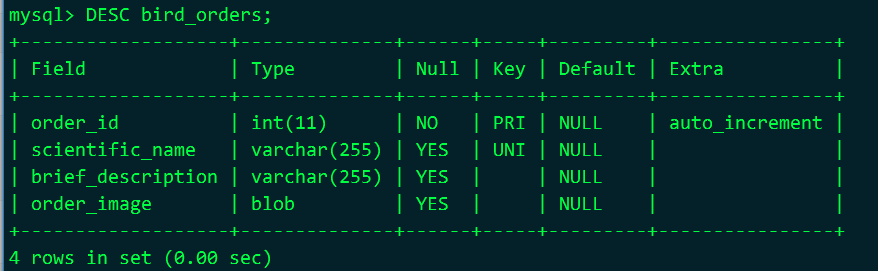
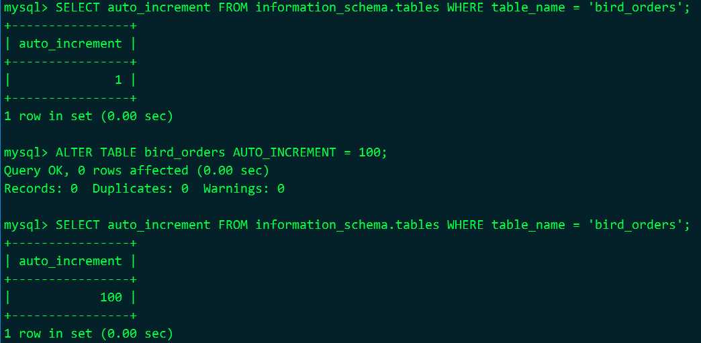
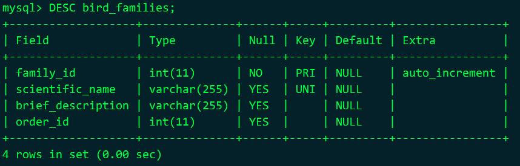
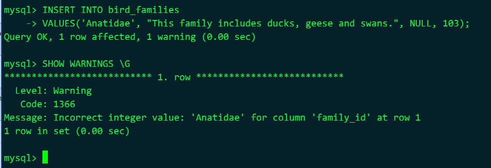
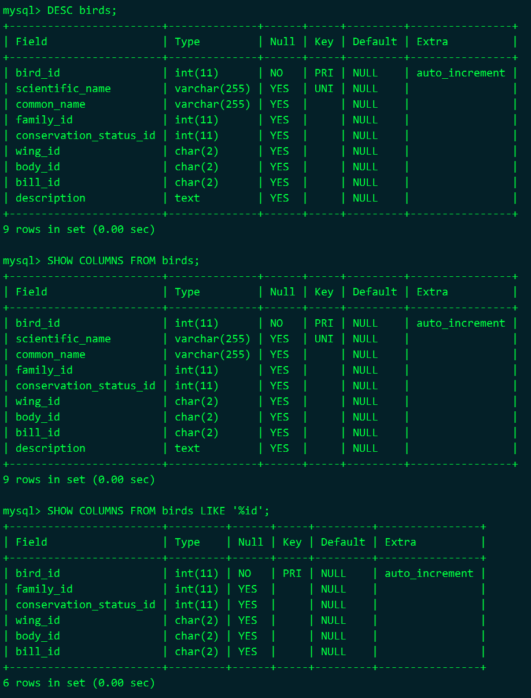
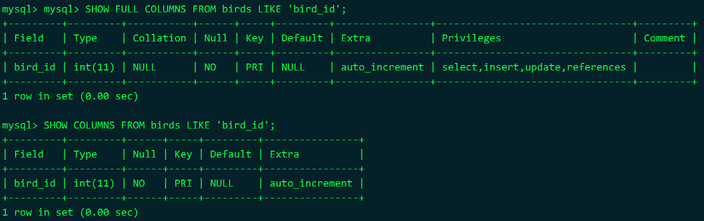
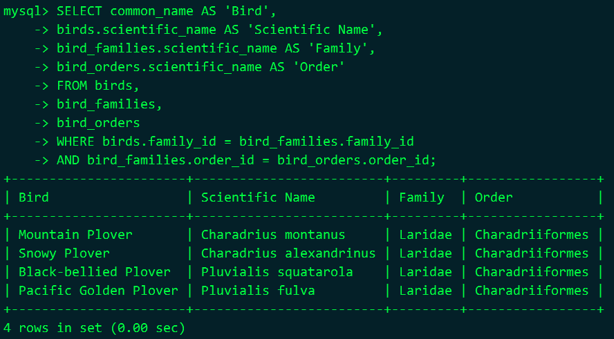
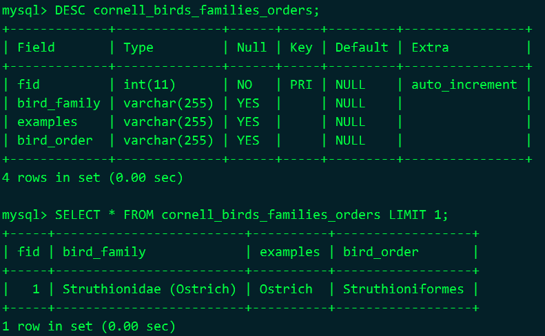
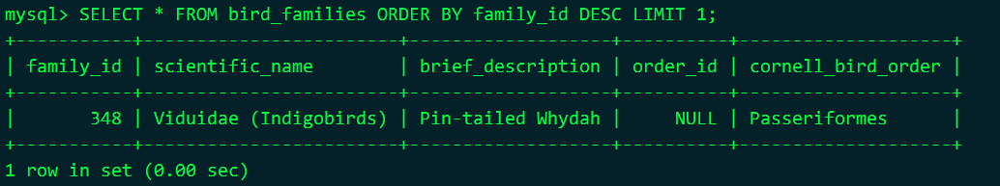
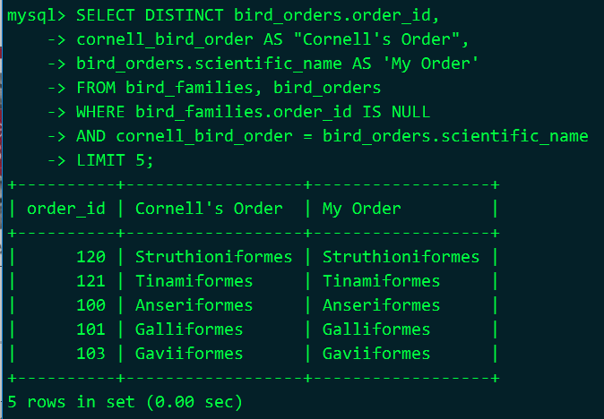

# 6 插入数据

## 6.1 语法

example

```sql
INSERT INTO books
(title, author, year)
VALUES('Visitation of Spirits','Randall Kenan','1989'),
('Heart of Darkness','Joseph Conrad','1902'),
('The Idiot','Fyodor Dostoevsky','1871');
```

## 6.2 实例

下载用到的表数据 http://mysqlresources.com/files

导入本章用到的表

```shell
mysql -urussell -p \
rookery < ~/learningmariadb-ch06-start.sql

# 说明
# 确保有数据库rookery
# 确保russell用户及权限
# 下载相应的sql放到家目录下
```

### 6.2.1 鸟目表 

查看表字段

```sql
DESC bird_orders;
```

 

设置自增列从100开始

```sql
-- 查看表的自增列的当前值
SELECT auto_increment FROM information_schema.tables WHERE table_name = 'bird_orders';

-- 设置设置自增列
ALTER TABLE birds AUTO_INCREMENT = 100;
```

 

插入数据

[learningmariadb-ch06-data.sql](resources/learningmariadb-ch06-data.sql)

### 6.2.2 鸟科表 

查看表结构

```sql
DESC bird_families;
```

 

查看警告信息

```sql
SHOW WARNINGS \G

-- 说明
-- 执行完sql，出现1 warning字样，说明有警告信息
-- 实验完，要删除这条错误数据
```

 

插入数据

[learningmariadb-ch06-data.sql](resources/learningmariadb-ch06-data.sql)

### 6.2.3 鸟种表

查看数据列 DESC与SHOW

```sql
DESC birds;
SHOW COLUMNS FROM birds;
SHOW COLUMNS FROM birds LIKE '%id';

-- 说明
-- SHOW COLUMNS语句可能基于某些模式来过滤结果， %作为通配符，代表任意字符
-- SHOW FULL COLUMNS可以查看更详细的信息
```

 

SHOW FULL COLUMNS

 

插入数据

[learningmariadb-ch06-data.sql](resources/learningmariadb-ch06-data.sql)

三表联合查询

```sql
SELECT common_name AS 'Bird',
birds.scientific_name AS 'Scientific Name',
bird_families.scientific_name AS 'Family',
bird_orders.scientific_name AS 'Order'
FROM birds,
bird_families,
bird_orders
WHERE birds.family_id = bird_families.family_id
AND bird_families.order_id = bird_orders.order_id;
```

 

## 6.3 其他选择

### 6.3.1 明确插入

```sql
INSERT INTO bird_families
SET scientific_name = 'Rallidae',
order_id = 113;

-- 说明
-- 这种写法保证你不会输错
-- 这种语法每次只能插入一行数据
```

### 6.3.2 插入其他表中的数据

"其他表"中的数据

[cornell_birds_families_orders.sql](sources/cornell_birds_families_orders.sql)

```shell
mysql -urussell -p \
rookery < ~/cornell_birds_families_orders.sql
```

查看"其他表"中的数据

 

将cornell_birds_families_orders表中的数据插入到bird_families表中

```sql
ALTER TABLE bird_families ADD COLUMN cornell_bird_order VARCHAR(255);

INSERT IGNORE INTO bird_families 
(scientific_name, brief_description, cornell_bird_order)
SELECT bird_family, examples, bird_order FROM cornell_birds_families_orders;

-- 说明
-- 从上述两个sql中可以看到其对应关系
-- IGNORE标志则指示服务器忽略所错误
-- bird_families已经有一部分数据，scientific_name有UNIQUE约束，要忽略重复列名的错误
```

查看插入是否正常

 

### 6.3.3 题外话：设置正确的order_id

测试一下，我们的鸟目名与康奈尔的对得上

```sql
SELECT DISTINCT bird_orders.order_id,
cornell_bird_order AS "Cornell's Order",
bird_orders.scientific_name AS 'My Order'
FROM bird_families, bird_orders
WHERE bird_families.order_id IS NULL
AND cornell_bird_order = bird_orders.scientific_name
LIMIT 5;
```

 

更新bird_families表中的order_id字段

```sql
UPDATE bird_families, bird_orders
SET bird_families.order_id = bird_orders.order_id
WHERE bird_families.order_id IS NULL
AND cornell_bird_order = bird_orders.scientific_name;
```

查看bird_families

```sql
SELECT * FROM bird_families ORDER BY familiy_id DESC LIMIT 4;
```

清除多余表及还原bird_families表结构

```sql
ALTER TABLE bird_families
DROP COLUMN cornell_bird_order;
DROP TABLE cornell_birds_families_orders;
```

### 6.3.4 替换数据

```sql
EPLACE INTO bird_families
(scientific_name, brief_description, order_id)
VALUES('Viduidae', 'Indigobirds & Whydahs', 128),
('Estrildidae', 'Waxbills, Weaver Finches, & Allies', 128),
('Ploceidae', 'Weavers, Malimbe, & Bishops', 128);

-- 说明
-- scientific_name是唯一的，如果重复就先删除再插入
```

### 6.3.5 数据插入的优先级

**MySQL默认设置：更改数据的语句（ INSERT、 UPDATE 和 DELETE），会比查询语句（SELECT）具有更高的优先级。 **

调低INSERT的优先级

```sql
INSERT LOW_PRIORITY INTO bird_sightings
...

-- 说明
-- 低优先级语句排在队列后面
-- 如果低优先级语句A未执行，这时来了个高优级语句，会排在A前边
-- 如果低优先级语句A正在执行，这时来了高优先级语句也只能等待
-- InnoDB引擎的表不支持LOW_PRIORITY和HIGH_PRIORITY
-- 因为InnoDB只锁定相关的行而不锁定整个表
```

延迟插入

```sql
INSERT DELAYED INTO bird_sightings
...

-- 说明
-- 5.5.6开始就不提倡使用了
```

提升INSERT的优先级

```sql
INSERT HIGH_PRIORITY INTO bird_sightings
...

-- 说明
-- 默认情况下INSERT优先级高于SELECT
-- 如果配置了--low-priority-updates
-- 会使得写入语句变为低优先级语句，或使其优先级至多等同于只读语句
-- INSERT中加上HIGHT_PRIORITY可以覆盖该设定，使INSERT先于SELECT
```

## 6.4 小结

备份一下数据

```sql
mysqldump -urussell -p rookery > /data/backup/rookery_ch06.`date +%F_%N`.sql
```

## 6.5 习题