# 7 查询数据

导入数据

```shell
mysql -urussell -p rookery < ~/learningmariadb-ch07-start.sql
```

## 7.1 基本查询 

```sql
SELECT bird_id, scientific_name, common_name FROM birds;
```

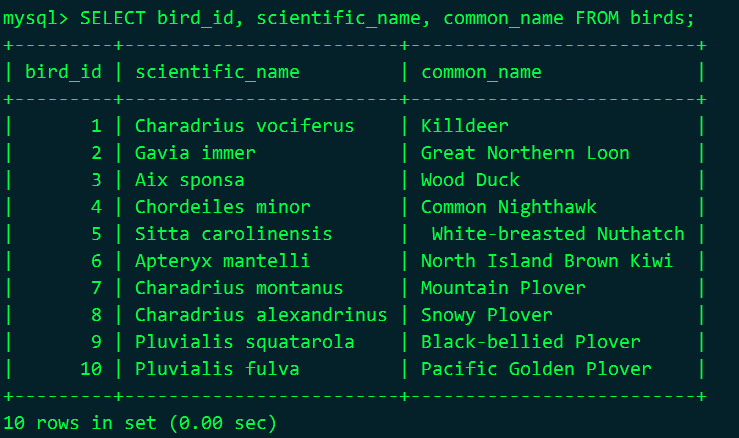  

## 7.2 有条件地查询 

```sql
SELECT common_name, scientific_name 
FROM birds WHERE family_id = 103 
ORDER BY common_name LIMIT 3;
```

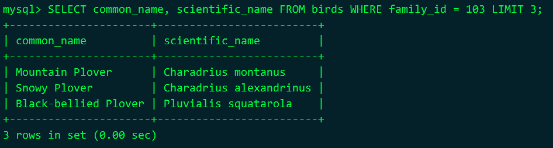 

## 7.3 结果排序 

```sql
SELECT common_name, scientific_name
FROM birds WHERE family_id = 103
ORDER BY common_name
LIMIT 3;
```

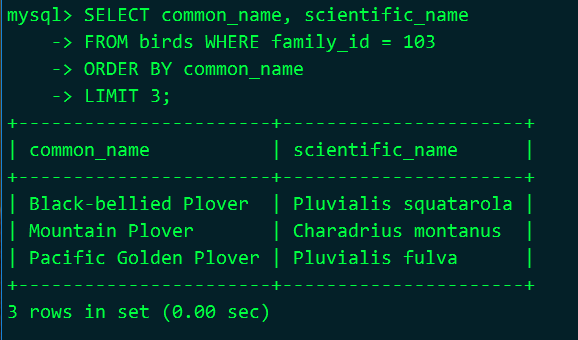 

```sql
SELECT * FROM bird_families
WHERE scientific_name查询数据 ｜ 91
IN('Charadriidae','Haematopodidae','Recurvirostridae','Scolopacidae');
```

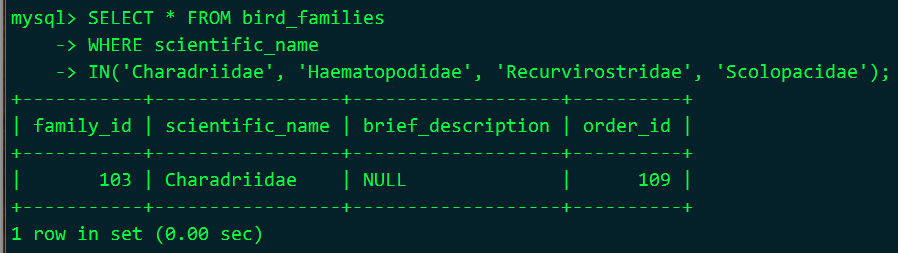 

```sql
SELECT common_name, scientific_name, family_id
FROM birds
WHERE family_id IN(103, 160, 162, 164)
ORDER BY common_name
LIMIT 3;
```

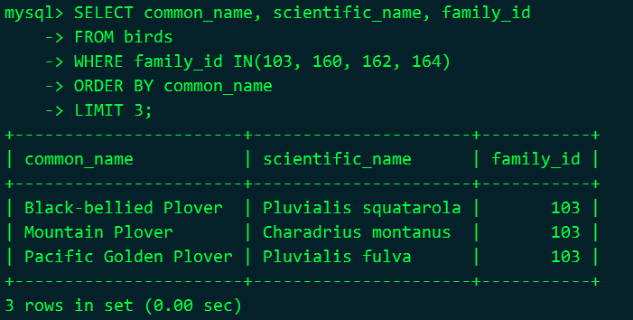 

```sql
SELECT common_name, scientific_name, family_id
FROM birds
WHERE family_id IN(103, 160, 162, 164)
AND common_name != ''
ORDER BY common_name
LIMIT 3;
```

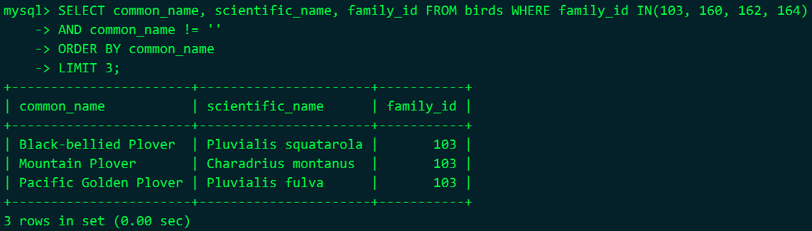  

## 7.4 限定结果集 

```sql
SELECT common_name, scientific_name, family_id FROM birds LIMIT 3, 2;

-- 说明
-- LIMIT 一个是开始位置，一个是行数
-- 显示第3行和第4行
```

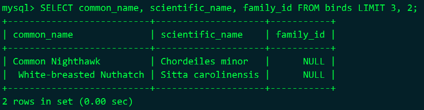 

## 7.5 表连接 

```sql
SELECT common_name AS 'Bird',
families.scientific_name AS 'Family'
FROM birds, bird_families AS families
WHERE birds.family_id = families.family_id
AND order_id = 102
AND common_name != ''
ORDER BY common_name LIMIT 10;
```

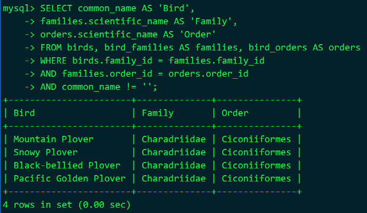    

## 7.6 表达式与LIKE 

```sql
SELECT common_name AS 'Birds Great and Small'
FROM birds
WHERE common_name REGEXP 'Great|Least'
ORDER BY family_id LIMIT 10;
```
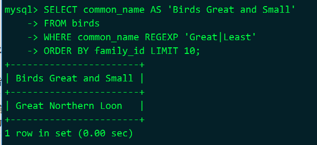

```sql
SELECT common_name AS 'Birds Great and Small'
FROM birds
WHERE common_name REGEXP 'Great|Least'
AND common_name NOT REGEXP 'Greater'
ORDER BY family_id LIMIT 10;
```

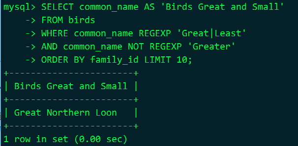 

```sql
SELECT common_name AS 'Hawks'
FROM birds
WHERE common_name REGEXP BINARY 'Hawk'
AND common_name NOT REGEXP 'Hawk-Owl'
ORDER BY family_id LIMIT 10;

-- 说明
-- BINARY表示区分大小写，REGEXP默认不区分大小写
```

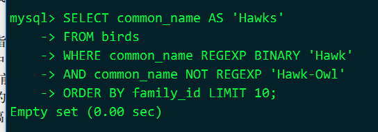 

> REGEXP 和 NOT REGEXP 不区分大小写，除非加上 BINARY 选项，如上例，这就指定了它按二进制来对比（因为 H 的二进制表示与 h 的是不同的）。但对于 common_name 列，其实不必要指定 BINARY 选项，因为它已经使用了二进制校对方式。这是我们在第 4 章开头建立 rookery 库时，无意识设定的。现在，用以下语句来看看 rookery 库是怎样建的： 

查看rookery库

```sql
SHOW CREATE DATABASE rookery \G
```

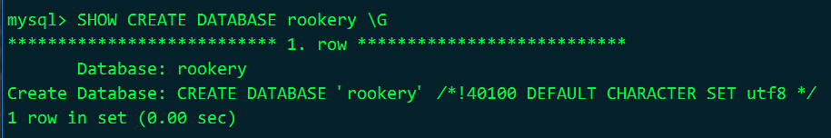 

查看common_name列

```sql
SHOW FULL COLUMNS FROM birds LIKE 'common_name' \G
```

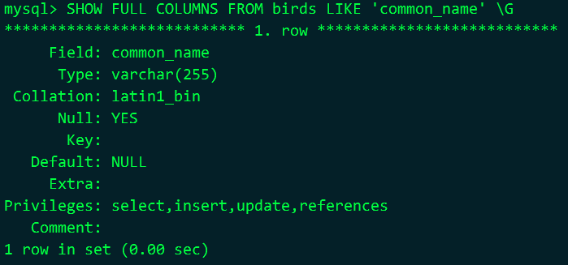 

## 7.7 对结果集进行计数和分组 

## 7.8 小结 

## 7.9 习题 


