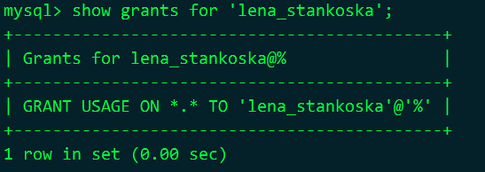
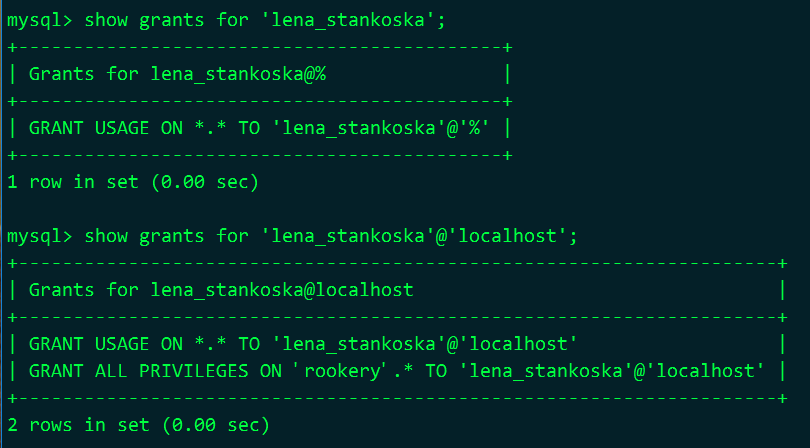
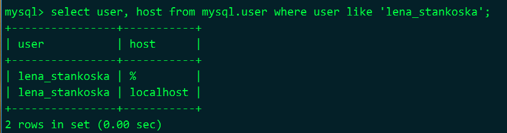
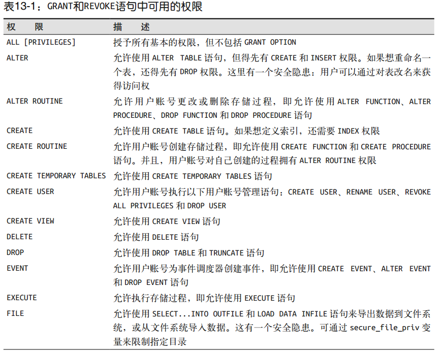
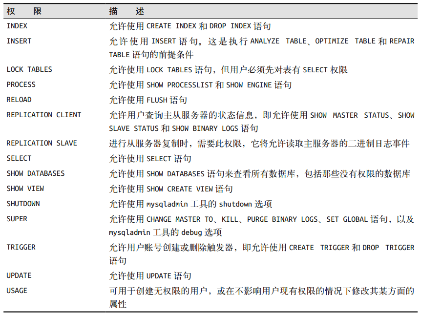

# 13 用户账号和权限

## 13.1 用户账号的基础知识

用户账号：访问和权限基于用户和主机的组合

创建用户

```sql
create user 'lena_stankoska';
show grants for 'lena_stankoska';
```

 

授权

```sql
grant all on rookery.* to 'lena_stankoska'@'localhost';
```



查看用户账号信息

```sql
select user, host from mysql.user where user like 'lena_stankoska';
```



## 13.2  限制用户账号的访问权限

### 13.2.1 用户名和主机 

1. 谁登录，从哪里登录
2. "谁"
   可以给每个人都建一个用户名，
   也可以给一群人建一个用户名(为某个部门)
   也可以按功能、用户途起名
3. 主机名：能通过DNS查找到的名字，或实际的IP地址
4. DNS查找可以是外部域名服务器或bind程序或hosts文件(/etc/hosts)

创建用户

```shell
# 工作用
create user 'lena_stankoska'@'localhost'
identified by 'her_password_123';

# 在家用
grant usage on *.* to 'lena_stankoska'@'lena_stankoska_home'
identified by 'her_password_123';

# 说明
# grant创建用户账号时，如果所指用户名不存在则会自动创建用户
```

### 13.2.2 权限 

两个账号 lena_stankoska@localhost、lena_stankoska@localhost

两个数据库 rookery、birdwatchers

操作 select、insert、update

如上两个账号对如上两个数据库有如上的操作

```sql
GRANT SELECT, INSERT, UPDATE ON rookery.*
TO 'lena_stankoska'@'localhost';
GRANT SELECT, INSERT, UPDATE ON birdwatchers.*
TO 'lena_stankoska'@'localhost';
SHOW GRANTS FOR 'lena_stankoska'@localhost \G
```

增加删除权限 

```sql
GRANT DELETE ON rookery.*
TO 'lena_stankoska'@'localhost';
GRANT DELETE ON birdwatchers.*用户账号和权限 ｜ 197
TO 'lena_stankoska'@'localhost';
SHOW GRANTS FOR 'lena_stankoska'@localhost \G
```



 

### 13.2.3 数据库组件和权限

限制访问特定的数据库

